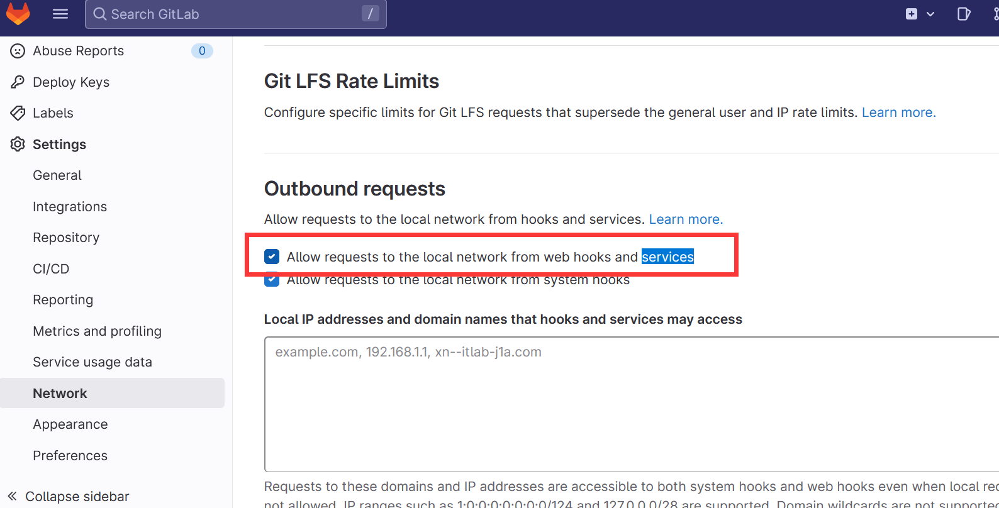
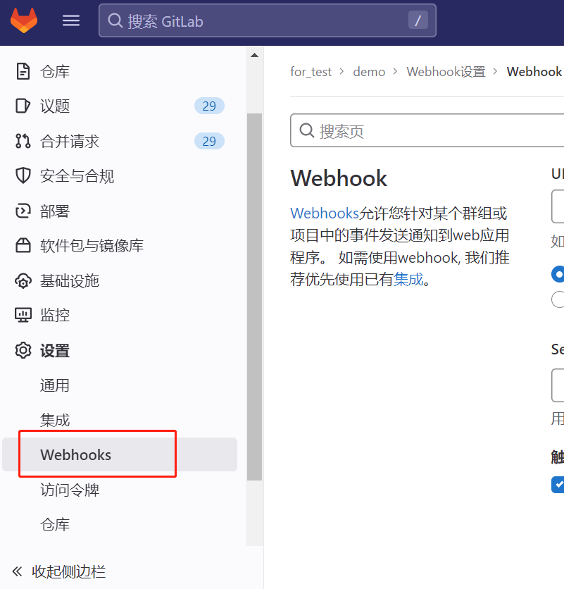
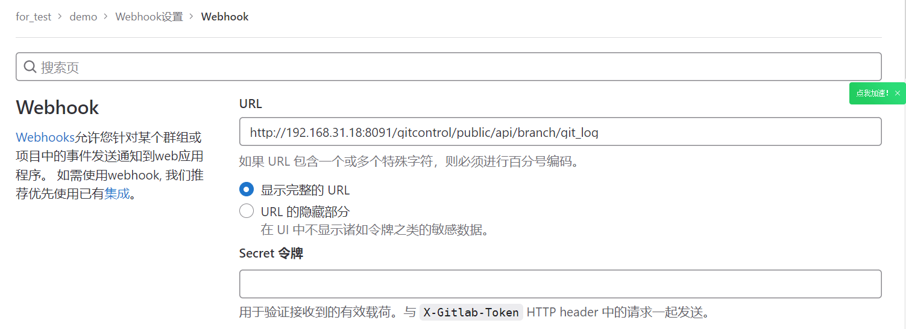
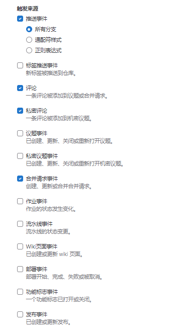
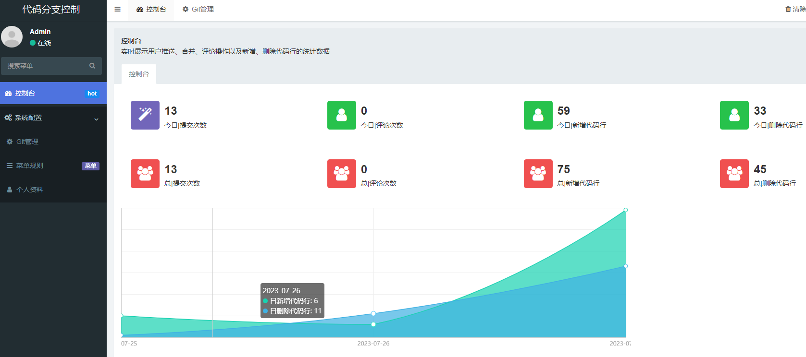
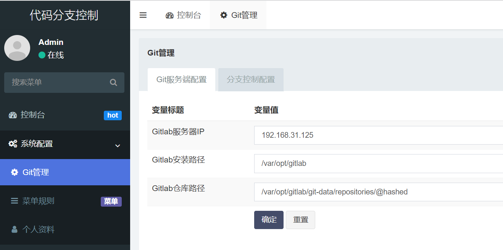
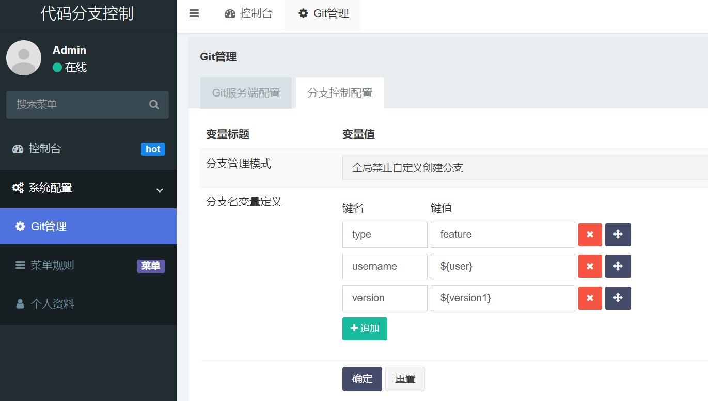
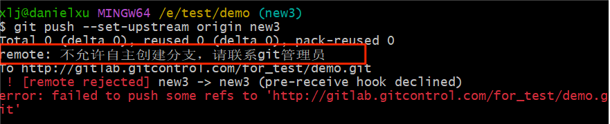
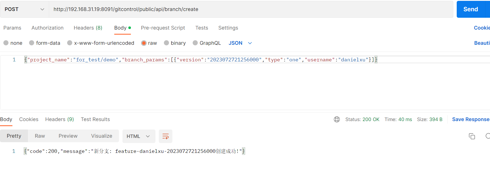

## 背景
在测试行业工作许久，在整个研发链路上推进质量控制体系的建设时经常会发现一个非常有趣的事情，有非常多的质量问题以及原因基本上每个公司都会存在，只是由于研发、质量基建的不同，其影响的严重程度有所区别而已，其中代码管理就是其中之一。
在质量体系建设过程中会发现以下几个典型问题与代码管理的推进力度有极强的线性相关：
* 代码分支管理混乱，分支过多且无序
* 经常出现代码冲突、漏合、错合、多合、忘合的原因导致了回归测试不通过或者出现较多的线上问题
* 由于编码规范的缺失或者执行力度的不同经常会在测试期间或者上线后出现些低级问题（即不应该出现的显性的非业务逻辑问题）或者部分技术框架的使用问题
* 静态代码扫描推进的非常缓慢

## 软件说明
主要从gitlab服务端的角度（客户端角度做的话虽然简单但漏洞较大）对代码的push操作实现管理功能，以及对代码的提交、合并、评论等做数据分析，便于提升代码质量、效能

## 功能说明
* **v1.0Release**

    划重点：主要具备基础的代码分支控制能力，以及基础的git信息和变更代码的基础数据收集

  * 支持全局维度控制是否允许创建代码分支
  * 支持自定义分支格式创建git分支
  * 对提交的代码数据进行简单统计分析（提交、合并、评论次数，新增、删除代码行数）

* **v1.1Release（计划）**

    划重点：：主要完善代码分支控制能力，以及代码分支规范管理能力

  * 支持自定义代码分支管理模式（如develop-->test-->prd模式下，开发develop分支名为：feature-[devname]-[now]，test分支名为：uat-[lastmergetime]，prd分支名为：release-[deploytime]，hotfix分支名为：hotfix-[now]。总之可以根据公司的实际情况自定义，并以此作为后续的代码分支规范）
  * 支持指定工程禁止创建代码分支
  * 支持工程及分支的热度分析和简单管理
  * 支持工程、分支、人员的git push信息下钻

## 安装使用
以下服务端环境：centos7+gitlab15.9.8+php7.2+mysql8.0
### 请一定要root账号来执行，否则会出现权限不够的请
### gitlab相关配置修改（**在修改前一定要对gitlab数据做备份**）
* 修改gitlab配置以支持gitaly（vim /etc/gitlab/gitlab.rb），将gitaly['custom_hooks_dir']前的注释去掉

    gitaly['custom_hooks_dir'] = "/var/opt/gitlab/gitaly/custom_hooks"
* 重新初始化gitlab配置，时间会比较长，需要耐心等下

    gitlab-ctl reconfigure
* 创建相关目录

    mkdir -p /var/opt/gitlab/gitaly/custom_hooks/pre-receive.d
* 重新启动gitlab服务

    gitlab-ctl restart
### 系统相关权限及功能支持

[//]: # (* 修改sudoers文件确保php执行shell文件成功（vim /etc/sudoers），在最后添加如下内容：（待定-----------------）)

[//]: # ()
[//]: # ()
[//]: # (      www  ALL=&#40;ALL&#41;    NOPASSWD:ALL)
*   修改php.ini配置，将disable_functions前面的注释去掉

    disable_functions = 
### gitcontrol服务部署
* 在gitlab上部署webserver并将gitcontrol代码部署到对应的ROOT目录下（假设网站目录为/www/admin/gitlab.gitcontrol.com_80/wwwroot）

    cd /www/admin/gitlab.gitcontrol.com_80/wwwroot
    git clone https://gitee.com/danielxu/gitcontrol.git
* 给gitcontrol目录授权（一般www为网站的执行用户和用户组）

    chown -R www:www /www/admin/gitcontrol.pigtwins.cn_80/wwwroot/gitcontrol
    chmod 777 -R /www/admin/gitcontrol.pigtwins.cn_80/wwwroot/gitcontrol
* 修改数据库配置，配置文件目录：gitcontrol/application/database.php

    // 服务器地址
    'hostname'        => Env::get('database.hostname', '127.0.0.1'),
    // 数据库名
    'database'        => Env::get('database.database', 'gitcontrol'),
    // 用户名
    'username'        => Env::get('database.username', 'admin'),
    // 密码
    'password'        => Env::get('database.password', 'admin'),
    // 端口
    'hostport'        => Env::get('database.hostport', '3306'),
* 导入初始化sql（gitcontrol库的数据格式utf8mb4）,初始化sql路径：gitcontrol/application/admin/lang/db/gitcontrol.sql

* 给gitaly授权

[//]: # (    chown -R www:www /var/opt/gitlab/gitaly)

[//]: # (    chown -R www:www /var/opt/gitlab/git-data)
    chmod 777 -R /var/opt/gitlab/gitaly

[//]: # (    chmod 755 -R /var/opt/gitlab/git-data)
### gitlab中的webhook配置
* 使用管理员账号登录gitlab并配置允许访问本地hook后保存当前更改

* 打开需要监控的工程webhook设置页面，路径：项目设置-->webhook

* url中输入git提交日志监控接口:http://[gitcontrol服务部署的服务器ip]:[port]/gitcontrol/public/api/branch/git_log

* 触发来源中勾选以下内容：推送事件（所有分支）、评论、私密评论、合并请求，并点击保存修改

这样所配置项目的远程仓库在接收到以上所选事件后就会自动处理
### 定时任务设置
* 可根据实际需要设置定时执行用户代码提交数据统计，可以通过crontab或者其他的定时任务，以天为单位（目前仅支持以天为单位）执行统计，比如每天凌晨1点统计一次：

    * 1 * * * sh /www/admin/gitcontrol.pigtwins.cn_80/wwwroot/gitcontrol/application/admin/lang/shell/getcodeinfo.sh /www/admin/gitcontrol.pigtwins.cn_80/wwwroot

这样每天凌晨1点就会自动从上次统计时间到目前的所有提交代码的新增和删除行，会按照工程、分支、提交人、提交时间统计

好了，现在可以开始代码分支控制的第一步了
## 界面截图
### 登录页面
地址：http://[gitcontrol服务器ip]:[端口]/gitcontrol/public/qeKjZyEbvx.php

用户名：admin

密　码：admin123

### Dashboard页面

### git信息配置

### 通用代码分支格式配置

### 在全局禁止自定义创建分支的情况下无法创建新分支

### 在全局禁止自定义创建分支的情况下与项目管理工具结合自动创建代码分支
API地址：http://[gitcontrol服务器ip]:[端口]/gitcontrol/public/api/branch/create
入参：

    {
      "project_name":"for_test/demo",//必传项，值为:[群组名]/[分支名]
      "branch_params":[//具体参数需要与后台设置的分支名变量定义一致
        {
          "version":"2023072721256000",//后台设置version参数为变量，此时会取接口所传值
          "type":"one",//后台设置type参数为常量，此时会取后台所设置值
          "username":"danielxu"//后台设置username为变量，此时会取接口所传值
        }
      ]
    }

## 问题反馈

在使用中有任何问题，请使用以下联系方式联系我们

QQ 1 群：903664781

Github: https://github.com/daniel1983cn/gitcontrol

Gitee: https://gitee.com/danielxu/gitcontrol

## 特别鸣谢

感谢以下的项目,排名不分先后

ThinkPHP：http://www.thinkphp.cn

FastAdmin：https://www.fastadmin.net/
